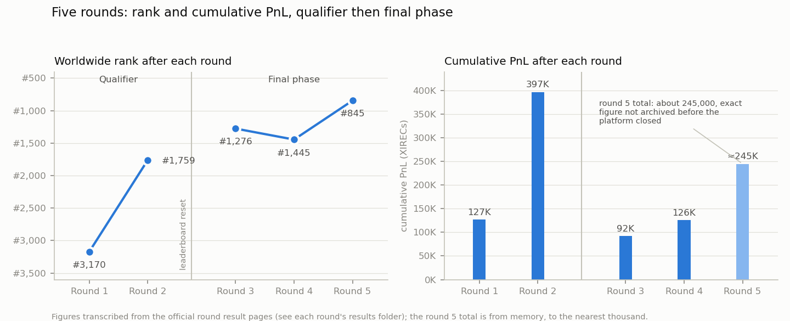

# IMC Prosperity 4

My solo participation in IMC Trading's Prosperity 4 algorithmic trading competition (April 2026), as team *Parisian Arbitrage*.

| | |
|---|---|
| **Final leaderboard** | **#845 worldwide, #39 in France**, about 245,000 XIRECs over the final phase |
| **Qualifier** | #1,759 worldwide after rounds 1 and 2, 396,880 XIRECs |
| **Best single result** | round 2 manual challenge: +191,533, rank 108 worldwide |
| **Best final-phase round** | round 5: roughly 120,000 combined, from rank 1,445 to 845 |
| **Format** | solo, 5 rounds, one algorithmic and one manual challenge per round |

Prosperity is a 5-round trading competition. Each round combines an **algorithmic challenge** (a Python `Trader` class running on a simulated multi-product exchange, with position limits and a hidden final simulation day) and a **manual challenge** (a one-shot quantitative game: auctions, allocation games, options pricing). Rounds 1 and 2 acted as qualifiers; the leaderboard was reset before round 3 for the final phase.



## Results

| Round | Algorithmic | Manual | Cumulative |
|---|---|---|---|
| 1 | +79,009 (rank 3,404) | +47,700 (rank 152) | 126,709 (rank 3,170) |
| 2 | +78,638 (rank 3,107) | +191,533 (rank 108) | 396,880 (rank 1,759) |
| | *leaderboard reset for the final phase* | | |
| 3 | +23,831 (rank 1,159) | +68,320 (rank 522) | 92,151 (rank 1,276) |
| 4 | +30,820 (rank 1,076) | +2,826 (rank 888) | 125,797 (rank 1,445) |
| 5 | *not archived* | *not archived* | about 245,000, **#845 worldwide, #39 France** |

Rounds 1 to 4 are transcribed from the official result pages, saved as screenshots in each round's `results/` folder. The platform closed shortly after the competition and the round 5 page was not saved in time; the final total is from memory, to the nearest thousand.

## What is in the strategies

- **Data analysis before strategy.** Every round started with regressions on the historical CSVs. Round 1's edge was recognizing a deterministic linear trend (R² = 0.9999) and a clean mean reversion, and switching from passive quoting to aggressive accumulation.
- **Options pricing.** Black-Scholes implemented from scratch, volatility calibrated on historical data (0.287 in round 3, refitted to 0.24 in round 4), per-strike bias corrections, and delta hedging of the options book under position limits.
- **Risk-driven product selection.** In round 4, strikes whose delta could not be hedged within position limits were removed from quoting entirely: about 22K of losses avoided and daily variance cut from ±37K to ±13K.
- **Monte Carlo pricing** (200,000 paths on the exact discrete monitoring grid) for the round 4 manual challenge on exotic options.
- **Game theory on the manual challenges**: rank-based allocation games, auction games against revealed distributions, bounded-herding reasoning on news-driven flows.
- **Fixed-data backtests to compare versions, never to predict live PnL.** Observed backtest-to-live gaps ranged from 2x to 10x.

## Round by round

- **[Round 1: Trading Groundwork](round1/README.md)**: two products, two regimes. Aggressive accumulation on a deterministic trend, market making around a hardcoded fair value on a mean-reverting product. Algo +79,009, manual +47,700.
- **[Round 2: Growing Your Outpost](round2/README.md)**: same products, a round of rigor. Two bug fixes worth about +37K on the worst backtest day, a blind-auction bid for extra market flow, and a game-theoretic allocation puzzle solved for rank 108 worldwide (+191,533), my best individual result.
- **[Round 3: Gloves Off](round3/README.md)**: options arrive. Calibrated Black-Scholes market making across 10 strikes; the developed strategy backtested about 38K per day, but was not ready at the 48-hour deadline, and a fallback submission scored +23,831. The most instructive failure of my competition.
- **[Round 4: The More The Merrier](round4/README.md)**: counterparty identities become visible. Behavioral profiling of the market's recurring participants, and the decision to stop quoting unhedgeable strikes. Algo +30,820. The manual exotic options challenge (+2,826) is a lesson in edge versus noise, and in what happens when every team runs the same model, written up in [its post-mortem](round4/MANUAL.md).
- **[Round 5: The Final Stretch](round5/README.md)**: 50 new products, full pivot to directional trading. Classification by directional consistency over the historical days, full-size conviction validated by a live A/B test of two variants. Roughly 120K combined and 600 places gained.

## Analysis

- [Post-mortem](analysis/post-mortem.md): the arc of the competition and seven cross-round lessons.
- [Decision records](docs/decisions/): the six structural decisions, each with context, alternatives and measured consequences.
- [Figures](analysis/figures/): rebuilt from the local historical data, from backtest reruns and from the official result pages, each labeled as such.

## Technical stack

- **Traders**: Python, standard library only, as the platform required. Black-Scholes pricing and delta written by hand. Each `trader.py` imports the competition's `datamodel` module, which the platform provides and the backtester bundles, so it is not included here.
- **Analysis**: numpy and pandas on the historical CSVs, Monte Carlo pricing for the round 4 manual challenge, matplotlib for the figures.
- **Backtesting**: the community backtester [`prosperity4btx`](https://github.com/xeeshan85/imc-prosperity-4-backtester). The round 2 and round 5 comparisons used `--match-trades none`, the pessimistic mode that never fills against market trades; the round 3 and 4 figures use the default matching. Every backtest figure quoted here is reproducible from the archived data with the scripts in this repository.
- **AI assistance**: Claude served as an analysis and coding assistant throughout, from data exploration to drafting versions, and through structured prompts under time pressure in round 5. Every strategy decision, calibration and number in this repository was checked by me, and the mistakes are mine.

## Repository layout

```
round1/ .. round5/   trader.py (final script of the round), README.md, MANUAL.md, results/ (official result pages)
analysis/            post-mortem and figures
docs/decisions/      architecture decision records
```
