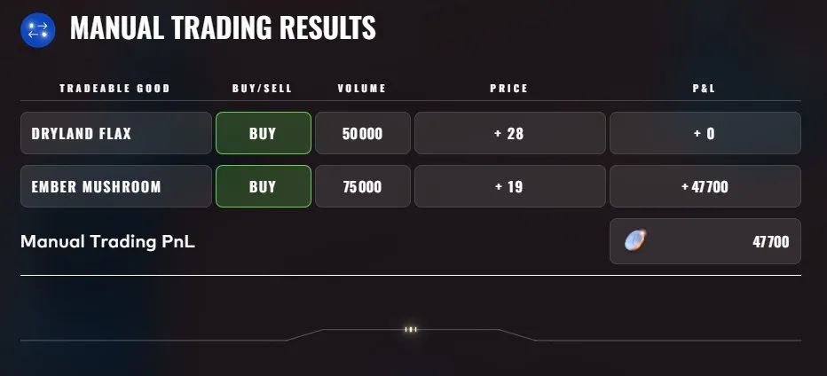
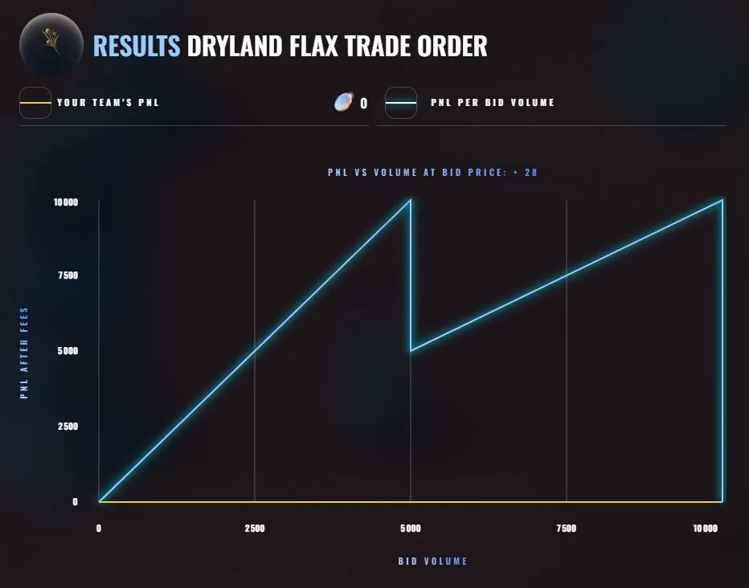
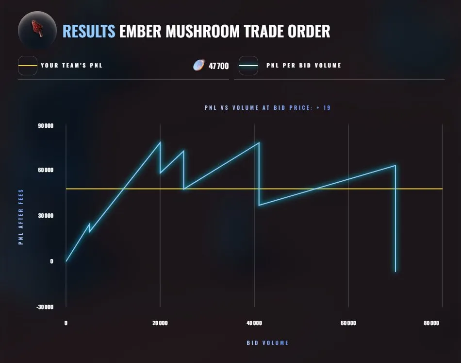

# Round 1 manual: the opening auctions

**Result: +47,700 XIRECs, rank 152**

## The game

Two one-shot auctions, one for `DRYLAND_FLAX` and one for `EMBER_MUSHROOM`. One single limit order per product, submitted after all other participants. The exchange picks one clearing price that maximizes traded volume, breaking ties toward the higher price. Fills follow price priority, then time priority.

There is no continuous trading afterwards: the acquired inventory is bought back at a fixed price, 30 per unit for FLAX (no fees) and 20 per unit for MUSHROOM (0.10 fee per unit traded). So the problem is purely: pick a price and a quantity that maximize (buyback - clearing price - fees) x filled volume, knowing that your own order can move the clearing price.

## What I submitted

| Product | Order | Result |
|---|---|---|
| `DRYLAND_FLAX` | buy 50,000 at 28 | 0 |
| `EMBER_MUSHROOM` | buy 75,000 at 19 | +47,700 |

## What the official charts show

For each product, the platform published the PnL that an order at my price would have made as a function of its volume.

**FLAX: the order was oversized, and the size is what killed it.** At 28, a bid of up to 5,000 units would have cleared with 2 of margin per unit, about 10,000 in total. Between 5,000 and 10,000 units the curve drops and then climbs back to 10,000, which is what a clearing price stepping up to 29 looks like: the margin falls to 1 on every unit. Beyond that, the clearing price reached the buyback price and the margin was zero. My 50,000 units sat far to the right of that chart. The book I saw before submitting showed about 40,000 units on offer at 28, so I sized against the displayed depth, and that depth did not survive contact with everybody else's orders. At the time I attributed the zero to time priority, having submitted on the last day of the round. That explanation does not produce the shape of the official curve. The volume does.

**MUSHROOM: right direction, wrong size.** The same curve for a bid at 19 peaks around 80,000 for roughly 20,000 units. My 75,000 units made 47,700.

## Lessons

- In a uniform-price auction your own volume sets the clearing price. Size against the depth available at your price, not against the budget, and treat the displayed book as a snapshot that other participants are about to consume.
- Submit finite-supply challenges as soon as the round opens anyway. It costs nothing and removes a failure mode.
