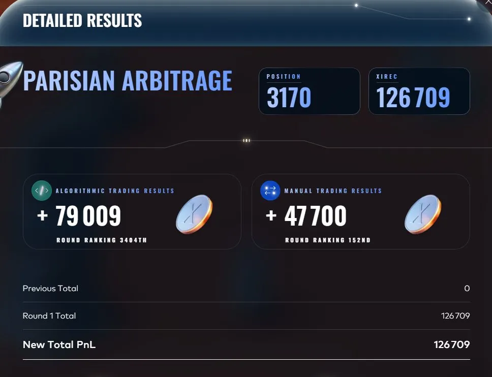
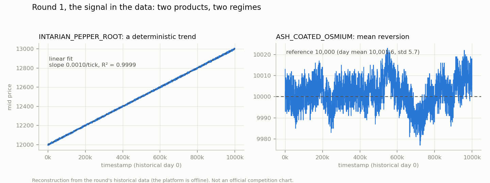
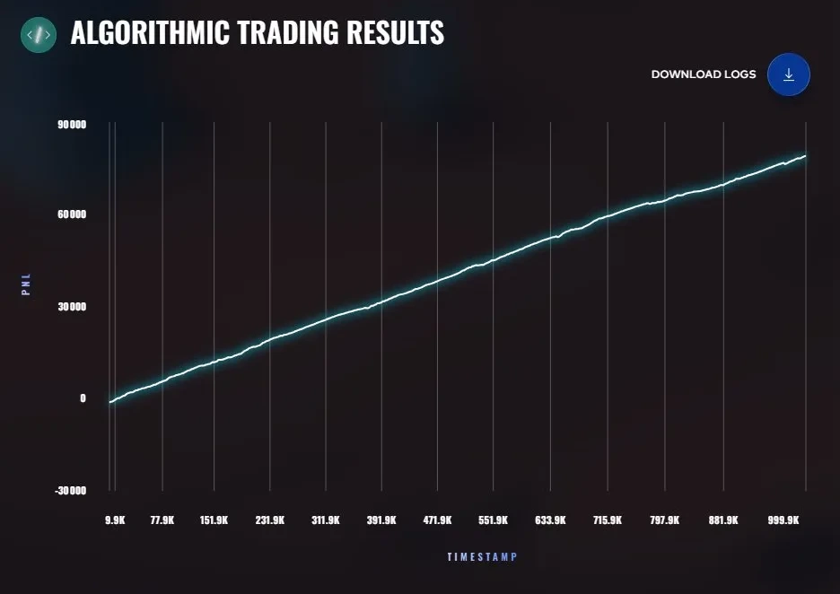

# Round 1: Trading Groundwork

**Algorithmic: +79,009 XIRECs (rank 3,404) · Manual: +47,700 (rank 152) · Cumulative: 126,709 (rank 3,170)**

## The round

Two products traded algorithmically, position limit 80 each:

- `INTARIAN_PEPPER_ROOT`, presented as a steady product
- `ASH_COATED_OSMIUM`, presented as volatile, with a hint that its behavior might follow a hidden pattern

The manual challenge was a pair of opening auctions with a guaranteed buyback, covered in [MANUAL.md](MANUAL.md).

## Data analysis first

Before writing any strategy I regressed the historical price data. The two products turned out to be textbook cases of two different regimes:

- **PEPPER is a deterministic trend.** Price = intercept + 0.001 x timestamp, with R² = 0.9999, about +1,000 per day. The price path is a straight line with small noise around it.
- **OSMIUM is pure mean reversion.** Long-term mean 10,000, standard deviation around 5.

That analysis, not the market making machinery, was the real edge of the round.

*Reconstruction from the round's historical data ([script](../analysis/figures/generate_figures.py)).*

## Strategy submitted (v7, [trader.py](trader.py))

Two independent engines:

- **PEPPER: aggressive long accumulation.** With a known upward trend, a long position held to end of day has a predictable expected gain. The trader takes every ask priced below fair + 0.5 x expected remaining gain, posts a bid just under fair to attract sellers, and posts its own ask far above, at fair + 0.8 x expected gain, so the accumulated position is not given back early.
- **OSMIUM: classic market making around a hardcoded fair value of 10,000**, with inventory skew. Hardcoding the fair value instead of estimating it from the instantaneous mid roughly doubled OSMIUM's backtest contribution (about 2,500 to about 6,000 per day).

## How it got there (v1 to v7)

- v1 to v5: generic market making on EMA / mid price. Plateau at about +2,200 on the platform test.
- v6: deterministic fair value for PEPPER, but passive execution. +2,210, essentially unchanged, with a flat PnL curve over the first 40,000 ticks. Conclusion: knowing the fair value is not enough, the position has to be taken aggressively.
- v7: aggressive accumulation. +7,782 on the platform test, +8,540 after hardcoding OSMIUM at 10,000. This is the submitted version.
- Tested along the way: changing the aggressiveness multiplier between 0.5 and 0.3 had no effect. The asks in the book always sat at fair +6 or +7, so the binding constraint was book depth, not the price threshold.
- Also fixed along the way: position limits were initially miscoded (10 to 35 instead of 80).

## Result and honest assessment

- Algorithmic: **+79,009**, rank 3,404.
- Manual: **+47,700**, rank 152 (details in [MANUAL.md](MANUAL.md)).
- Cumulative after round 1: 126,709, rank 3,170.

*Official platform chart of the live PnL, saved at the end of the round.*

The live curve is almost a straight line. The PnL is the accumulated PEPPER position drifting up with the trend, plus a few thousand from OSMIUM. With 80 units and a slope of about 1,000 per day, the ceiling of the accumulation strategy is around 80,000 on PEPPER, so the submitted version ran close to what the strategy could do.

What worked: doing the data analysis before the strategy, hardcoding known fair values instead of estimating them, and the passive-to-aggressive switch from v6 to v7.

What I only found out later: v7 carried two latent bugs, found while backtesting the same code on the round 2 data. The day length was wrong (99,900 ticks instead of 999,900), so once the timestamp passed 99,900, a tenth of the way into the day, the passive PEPPER ask fell to the estimated fair value and bots could drain the long position. And an underestimated intercept could trigger parasitic sells on PEPPER. Neither fired visibly on the live day, but on the worst round 2 historical day they cost about 37,000. Both were fixed for round 2, see [round2](../round2/README.md).
