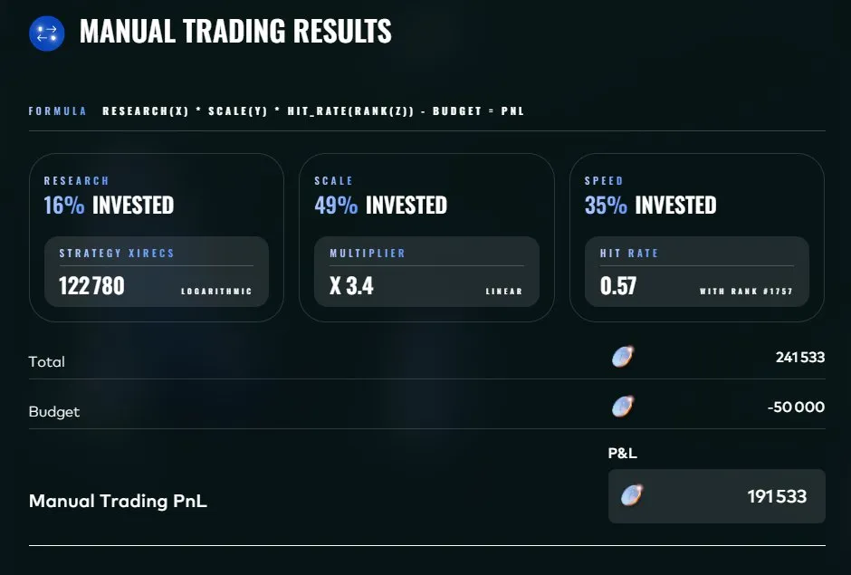
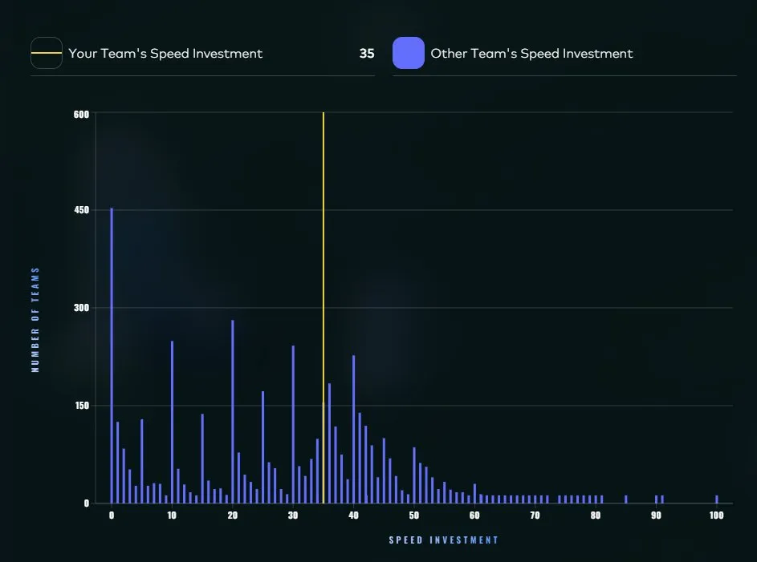

# Round 2 manual: Invest & Expand

**Result: +191,533 XIRECs, rank 108**

## The game

A budget of 50,000 XIRECs to allocate (in integer percentages) across three pillars:

- **Research**: grows logarithmically, `200,000 * ln(1 + x) / ln(101)`, so 200,000 at x = 100
- **Scale**: grows linearly to 7 at x = 100
- **Speed**: a rank-based multiplier across all participants, from 0.1 (lowest Speed investment) to 0.9 (highest), scaled linearly by rank, equal investments sharing a rank

Final score: `Research x Scale x Speed - budget used`.

## The game theory

The interesting pillar is Speed, because it is purely relative. If every participant invested 0 in Speed, everyone would share rank 1 and get the 0.9 multiplier. Speed spending produces nothing by itself: it only protects you from being outranked by others. So the question is not "how much Speed is worth" but "how much Speed will other people buy".

I modeled the Speed distribution as roughly uniform across participants and optimized the allocation under that assumption. The optimizer landed on **Research 16 / Scale 49 / Speed 35**, with a predicted PnL around 110,000.

## Result

**+191,533, rank 108.**

The outcome beat the prediction by a wide margin because the uniformity assumption was wrong in the favorable direction. The revealed distribution is nothing like uniform: the single largest group of teams, about 450, put 0% into Speed, and the rest clustered on round numbers (10, 20, 30, 40). My 35% ranked 1,757th on Speed, for a realized multiplier of 0.57 against 0.38 modeled.

Honest scorecard: the game-theoretic framing (Speed as a defensive good) was right and is what produced the result. The distributional model had roughly 45% prediction error, it just happened to err in my favor. Lesson kept for later rounds: real participant distributions are not uniform, they pile up on zero and on round numbers, and revealed distributions are worth reusing.
