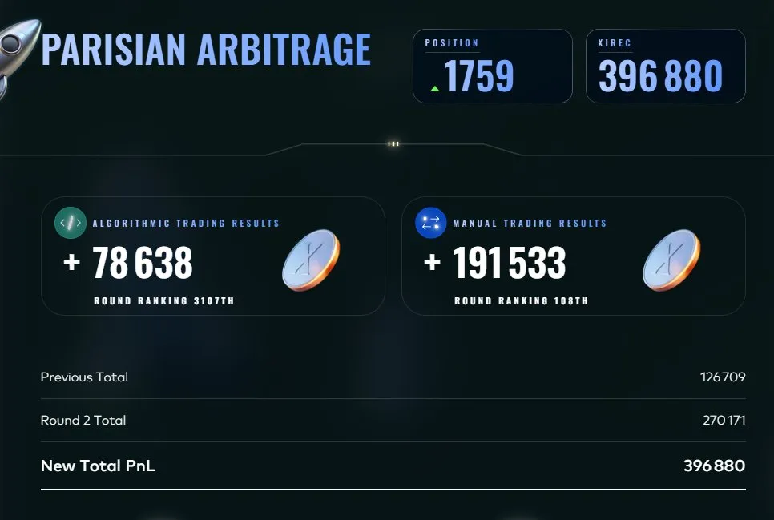
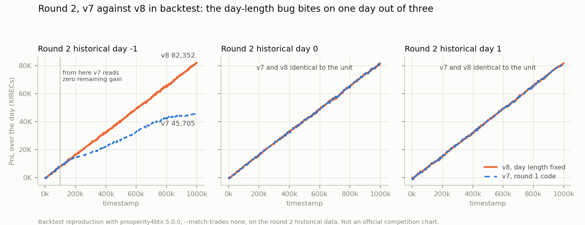
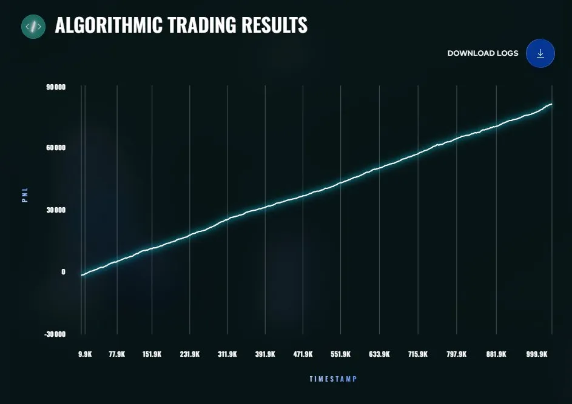

# Round 2: Growing Your Outpost

**Algorithmic: +78,638 XIRECs (rank 3,107) · Manual: +191,533 (rank 108) · Cumulative: 396,880 (rank 1,759)**

## The round

Same two products as round 1 (`ASH_COATED_OSMIUM`, `INTARIAN_PEPPER_ROOT`, limits 80), with one addition: a **Market Access Fee** (MAF), a blind auction run through a `bid()` method in the trader. The top 50% of bids across participants pay their bid once and see 25% more quotes in the order book (100% instead of 80% of the generated flow).

The manual challenge was a budget allocation game, covered in [MANUAL.md](MANUAL.md).

## Strategy submitted (v8, [trader.py](trader.py))

Same dual engine as round 1 (PEPPER trend accumulation, OSMIUM mean reversion), plus two bug fixes found by backtesting the round 1 code on the round 2 data:

1. **Day length.** `time_remaining` was computed against 99,900 ticks instead of 999,900. Once the timestamp passed 99,900, a tenth of the way into the day, the expected remaining gain read zero, the passive PEPPER ask fell to the estimated fair value, and bots could drain the accumulated long position for the rest of the day. Cost on the worst backtest day: about 37,000 XIRECs. Fix: `DAY_TICKS = 999_900`.
2. **Parasitic sells on PEPPER.** The estimated intercept sat about 5 points below the true trend, so roughly 160 times per day a bot bid crossed the estimated fair value and triggered a take-sell that unwound the position. Fix: no take-sells on PEPPER at all. The only exit is the high passive ask.

Backtests with the community backtester (`prosperity4btx trader.py 2 --match-trades none`): v7 209,247 over 3 days, v8 245,894, with the worst day going from 45,705 to 82,352. The other two days were identical to the unit: the bugs only bite on some days, which is exactly why they went unnoticed in round 1.

*Backtest reproduction ([script](../analysis/figures/generate_figures.py), series in [data/](../analysis/figures/data/)); not an official chart.*

### The MAF bid

I submitted a bid of 2,500. The value of the extra flow could not be simulated (the backtester has no with-MAF state), so I estimated it at roughly 1,000 to 2,000 XIRECs, explicitly an order-of-magnitude guess, and bid about 1.5x that estimate to aim for the top 50% without overpaying. **The auction outcome is unknown**: it was not documented at the time and cannot be reconstructed, since a one-time 2,500 deduction is invisible inside a +270K round.

### Platform noise vs fixed-data backtests

The platform preview scored v7 (8,061) above v8 (7,817). I established this as submission randomization noise (about ±300 between identical submissions) and trusted the fixed-data backtest instead. This became a standing rule, see [ADR 003](../docs/decisions/003-fixed-data-backtests-compare-versions.md).

### Tested and set aside

- **The platform preview as a tie-breaker.** Resubmitting an identical file moved the preview score by about ±300, more than the v7 versus v8 difference. Rejected as a decision input.
- **Optimistic fill matching.** With `--match-trades all` v8 backtested at 256,918 against about 246K with `--match-trades none`. The pessimistic mode was kept as the reference, so that an improvement is never an artefact of generous fills.
- **Simulating the MAF.** Not possible in the backtester, so the bid was sized by order of magnitude rather than by test.

## Result

- Algorithmic: **+78,638**, rank 3,107.
- Manual: **+191,533**, rank 108, my best individual result of the competition (details in [MANUAL.md](MANUAL.md)).
- Round total 270,171. Cumulative 396,880, rank 1,759 going into the leaderboard reset.

*Official platform chart of the live PnL.*

The live curve is the same straight line as in round 1, and the live PnL is essentially unchanged (78,638 against 79,009). That is consistent with the backtests: the two fixes matter on the days where the bugs fire. They protect the bad day rather than improve the good one.
