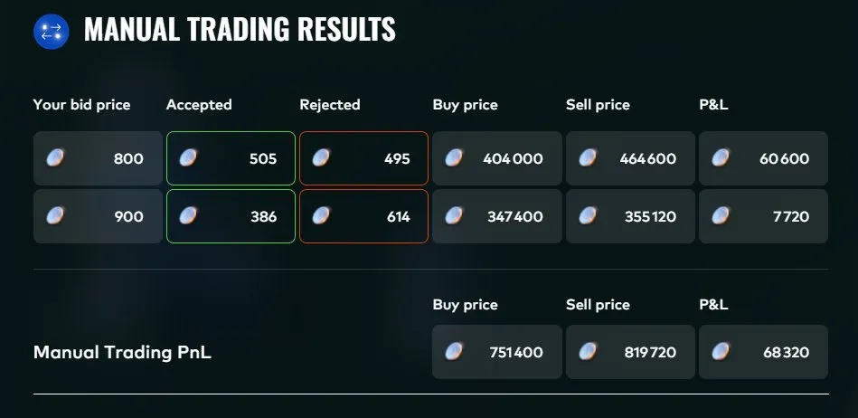
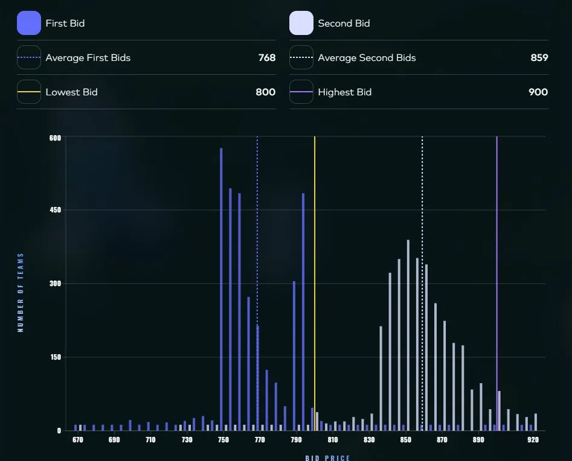

# Round 3 manual: the Celestial Gardeners' Guild

**Result: +68,320 XIRECs, rank 522**

## The game

An unknown number of counterparties each hold one unit and have a reserve price uniformly distributed on [670, 920] in increments of 5. You trade at most once with each. Everything you buy is resold at 920 the next day.

You submit two bids:

- **First bid b1**: trades at b1 with every counterparty whose reserve price is below it. Pure margin versus volume tradeoff, independent of other players.
- **Second bid b2**: trades at b2 with the remaining counterparties whose reserve price it beats, but if b2 is less than or equal to the average of all players' second bids, the PnL is multiplied by the penalty `((920 - avg_b2) / (920 - b2))^3`. So b2 is a game against the field: you need to clear the crowd's average, without giving up all the margin to do it.

## What I submitted, and what was revealed

I submitted **b1 = 800, b2 = 900**, my own picks made under the 48-hour clock before the full analysis was finished. The completed analysis recommended 791 / 880.

There were 1,000 counterparties, about 20 per price level, not the one per level my pre-round model had assumed. That scale error multiplied every PnL estimate by about 20 but did not move the optimal bids, which only depend on the shape of the reserve-price distribution. The revealed averages were avg_b1 = 768 and avg_b2 = 859.

- **b1 = 800 was close to optimal.** 505 counterparties accepted, 120 of margin each, 60,600. The best first bid in hindsight was 795, worth about 62,500: a 2K difference.
- **b2 = 900 was too cautious.** It cleared the field average with room to spare (900 against 859), so no penalty applied, but every point above the optimum was margin given away: 386 fills at only 20 of margin, 7,720. A second bid around 860 to 865 would have captured about 240 counterparties at roughly 60 of margin, about 14,000. Some 6,000 to 7,000 left on the table, close to a tenth of the round's manual result.

## Lessons

- The penalty structure punishes being below average brutally (cubic), but only linearly rewards margin above it. The optimum sits just above where you expect the crowd's average, not far above it.
- Revealed distributions are reusable information: avg_b2 = 859 from this round is a data point on how this player pool bids, and I treated it as such for the later manual challenges.
