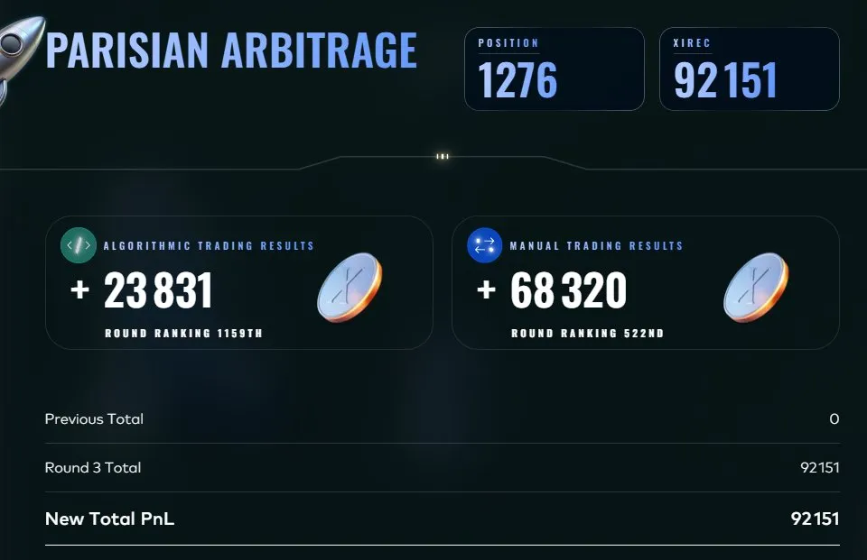
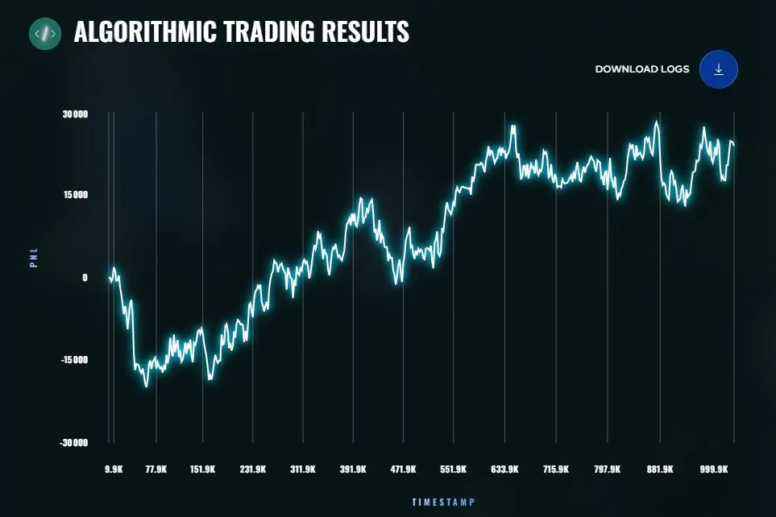

# Round 3: Gloves Off

**Algorithmic: +23,831 XIRECs (rank 1,159) · Manual: +68,320 (rank 522) · Cumulative: 92,151 (rank 1,276)**

## The round

Start of the final phase: the leaderboard was reset to zero and rounds shortened to 48 hours. New products:

- `HYDROGEL_PACK` (position limit 200)
- `VELVETFRUIT_EXTRACT` (200), the underlying
- 10 call options on it, `VEV_4000` to `VEV_6500` (300 each), expiring 7 days after round 1, so time to expiry was 5 days at the start of this round

The manual challenge was a two-bid game against counterparties with uniform reserve prices, covered in [MANUAL.md](MANUAL.md).

## Strategy developed ([trader.py](trader.py))

- **HYDROGEL_PACK: mean reversion around a hardcoded fair value of 10,000.** The main PnL engine, about 27K per day in backtest.
- **VELVETFRUIT_EXTRACT: market making around the volume-weighted mid.**
- **Options: Black-Scholes, calibrated rather than assumed.** Sigma = 0.287 annualized, fitted on 3 days of history (mean error near zero, mean absolute error 2.37). TTE = (5 - t/1,000,000) / 365, after establishing that one calendar day is one million ticks and that theta decay inside a round is negligible. Per-strike bias corrections measured against market prices (for example VEV_5400 trades about 2 below the BS value). Deep ITM strikes (4000, 4500) quoted with a wider required edge and smaller size; the far OTM strikes (6000, 6500) skipped as worthless.

The first complete version (v1) backtested at **116,286 over the 3 historical days**, about 38.7K per day.

### Iterations

- **v2, delta hedging through the underlying: rejected.** Backtest 78,543, clearly worse than v1. VEF itself is mean reverting, so the hedge systematically bought after the move and ended up long at the wrong moment. Hedging a mean-reverting underlying's own moves destroys value. See [ADR 004](../docs/decisions/004-no-delta-hedge-on-mean-reverting-underlying.md).
- **v3, the file in this folder: doubled HYDROGEL size, lowered the VEV_4500 edge, tightened the options quoting spread.** Backtest 115,411, nearly identical to v1. HYDROGEL is capped by book depth (about 15 units per level), so v1 was already close to the achievable ceiling.

The round 3 backtest figures use the backtester's default fill matching; with the pessimistic `--match-trades none`, the v3 file makes 104,823.

Known residual leaks (VEV_5000 on day 0, options on day 1) were identified as pure unhedgeable delta risk within this setup. That observation seeded the key decision of round 4.

## What actually ran in competition

The 48-hour format caught me out. The strategy above was not ready by the submission deadline, so I submitted a fallback version assembled quickly instead. It backtested around 56K and scored **+23,831** live, against roughly 38K per day projected for the developed strategy. That gap, on the order of 15K, was the most avoidable loss of my competition, and it was operational, not analytical.

*Official platform chart of the live PnL of the fallback version.*

Process lessons, applied from round 4 onward: have a submittable candidate ready at mid-round, freeze the final file well before the deadline, and verify the file (checksum) before submitting.

## Result

- Algorithmic: **+23,831**, rank 1,159.
- Manual: **+68,320**, rank 522 (details in [MANUAL.md](MANUAL.md)).
- Round total 92,151, rank 1,276.

The Black-Scholes calibration work (sigma, TTE convention, per-strike biases) carried directly into round 4, where it paid off.
