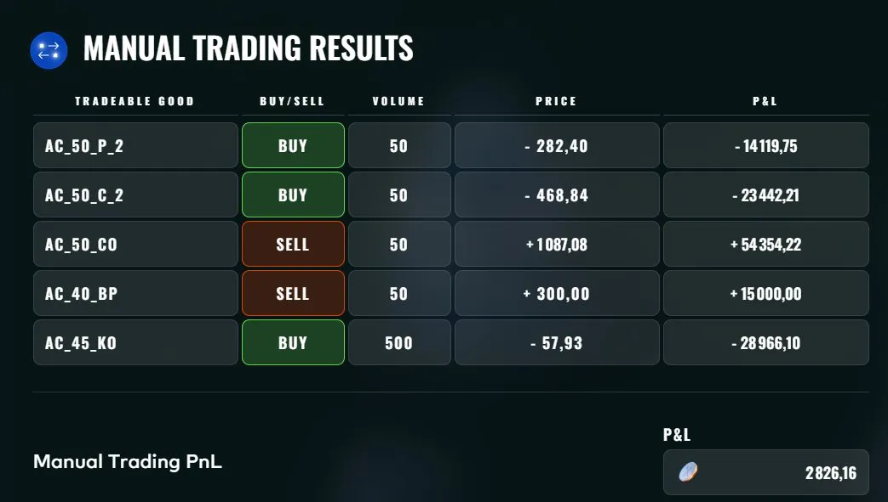
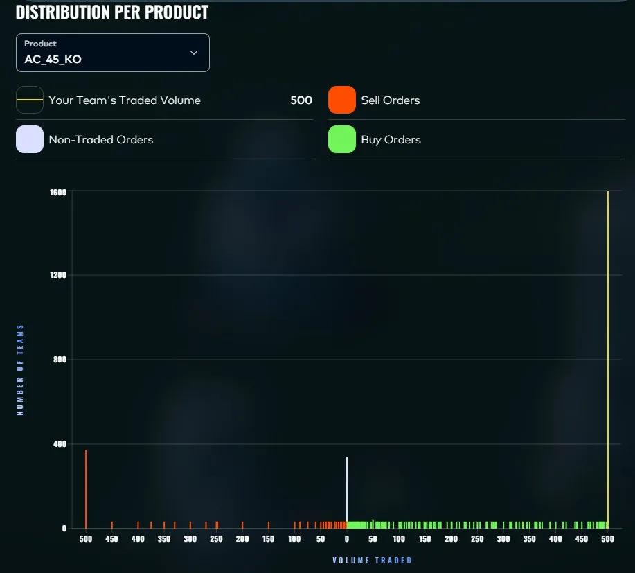

# Round 4 manual: exotic options on AETHER_CRYSTAL

**Result: +2,826 XIRECs, rank 888**

## The game

A standalone, one-shot options challenge. The underlying `AETHER_CRYSTAL` starts at 50 and follows a geometric Brownian motion with zero drift and 251% annualized volatility, on a discrete grid of 4 steps per trading day (252 trading days per year). Tradable: the underlying, vanilla calls and puts at 2 and 3 week expiries, and three exotics written on the same underlying:

- a **chooser option** (after 2 weeks the holder picks call or put, whichever is in the money)
- a **binary put** (fixed payout if the underlying finishes below the strike)
- a **knock-out put** (a put that dies if the underlying ever touches the barrier at a monitoring step)

Positions are entered at t = 0 and held to expiry. The score is the average PnL over 100 simulated paths shared across all teams.

## Approach: reprice everything, trade the gaps

I repriced every listed contract by Monte Carlo, 200,000 paths on the exact discrete monitoring grid, and compared with the quoted prices. Five positions showed meaningful edge:

- **Sell the chooser** (edge about +0.30 per unit)
- **Sell the binary put** (about +0.23 per unit)
- **Buy the 2-week ATM straddle**, call and put legs (about +0.12 per unit per leg)
- **Buy the knock-out put**, in size

Risk management was explicit: one candidate (a 60-strike call) was excluded because its tiny edge came with a 125% increase in portfolio standard deviation, and the chooser short plus straddle long combination hedges itself substantially (an 87.6% standard deviation reduction versus the naked short). Portfolio expectation: about +161K, Sharpe 0.97, probability of loss 16%.

### The knock-out put debate

Priced with a continuous barrier, the knock-out put was worth about 0.129 against a 0.175 ask: a sell. Applying the Broadie-Glasserman-Kou correction for discrete monitoring moved the value to about 0.219, flipping the decision to a buy, and a second model consulted in parallel agreed. I took the buy, in the largest size of the five positions.

## Result: +2,826, and an instructive post-mortem

| Contract | Side | Volume | P&L |
|---|---|---|---|
| `AC_50_CO`, chooser | sell | 50 | +54,354 |
| `AC_40_BP`, binary put | sell | 50 | +15,000 |
| `AC_50_C_2`, 2-week call | buy | 50 | -23,442 |
| `AC_50_P_2`, 2-week put | buy | 50 | -14,120 |
| `AC_45_KO`, knock-out put | buy | 500 | -28,966 |

In hindsight, all five instruments were overpriced: selling everything was the optimal book. Two of my three buys were the two largest losses.

- The straddle's +0.12 per leg edge was below the noise floor of 100 shared simulations at 251% volatility. Edge below roughly 0.20 per unit was not survivable in this setup, and both shorts that won had 0.23 and 0.30.
- The BGK correction is correct in theory, but at 251% volatility its magnitude was large enough to flip a decision on its own. I acted on the flip without testing the sensitivity of the conclusion to the correction's assumptions. It cost about 29K.

### The whole field made the same trades

The platform published, for each contract, the distribution of traded volumes across teams. On every contract my order sat on the crowd's mode: close to 2,000 teams sold the chooser and the binary put at the maximum volume, close to 2,000 bought each straddle leg at the maximum, and about 1,600 bought the knock-out put at the maximum of 500 units, against roughly 380 who sold it and 340 who stayed out.

Rank 888 on this challenge is the rank of the consensus book. Every team's model said the same thing, and every team's model was wrong on the same three legs. That is a lesson of its own: when the analysis is the one every well-equipped team will produce, the crowd's error is your error, and the only differentiators left are sizing and restraint. The distributions for the other four contracts are in [results/](results/).

Rules I wrote down for myself: demand edge above 0.20 per unit under this kind of scoring noise, default to selling overpriced exotics rather than buying "cheap" ones, and treat refined model corrections at extreme parameter values as hypotheses to stress, not answers.
