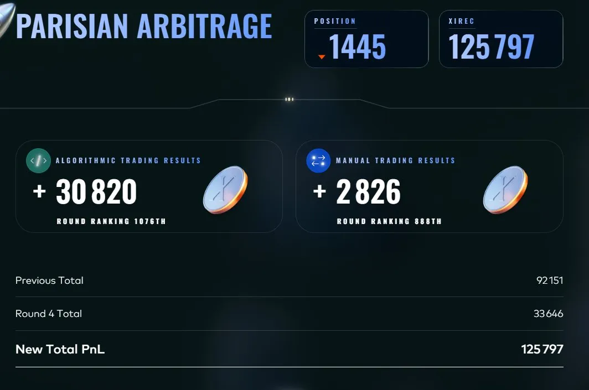
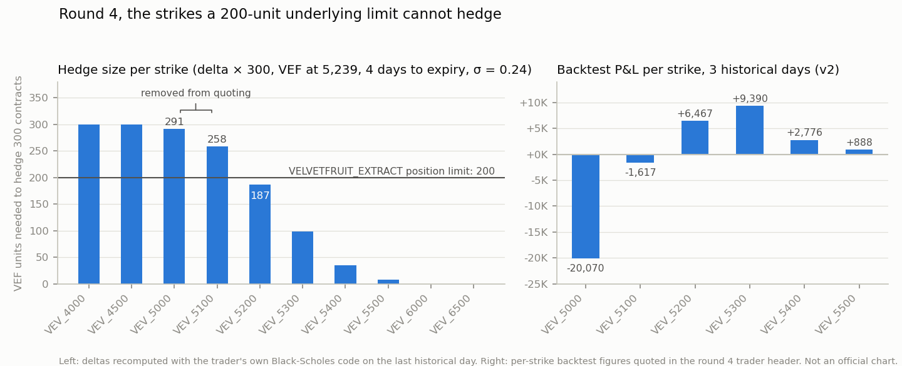
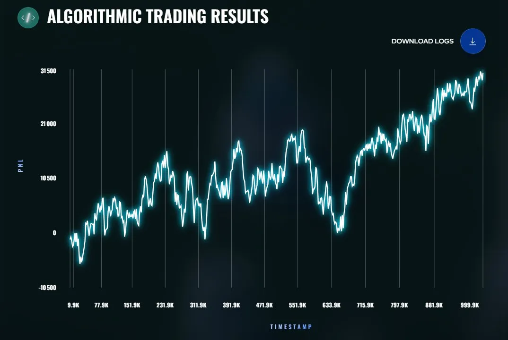

# Round 4: The More The Merrier

**Algorithmic: +30,820 XIRECs (rank 1,076) · Manual: +2,826 (rank 888) · Cumulative: 125,797 (rank 1,445)**

## The round

Same products as round 3 (`HYDROGEL_PACK`, `VELVETFRUIT_EXTRACT`, the 10 `VEV_*` calls, TTE now 4 days), with one major change: counterparty identities became visible in the `Trade.buyer` and `Trade.seller` fields.

The manual challenge was a standalone exotic options problem, covered in [MANUAL.md](MANUAL.md).

## Strategy (v3, [trader.py](trader.py))

### Recalibration

Volatility refitted on the newer data: sigma 0.287 to 0.24. Per-strike biases remeasured (5200: +0.6, 5300: +1.6, 5400: -1.5, 5500: +0.7). HYDROGEL kept at a hardcoded fair of 10,000 with a ±6 spread, VEF quoted at ±2.5.

### Counterparty mapping

With identities visible, I profiled the recurring participants ("Marks") from the historical trades. Two are exploited directly in the code:

- **Mark 01**, a persistent buyer of OTM calls (5300 to 6500): quote size on those strikes increases while he is active.
- **Mark 67**, a one-way buyer of VEF: the VEF fair value is shifted +0.5 while he is buying.

The rest of the map served as validation: Mark 14 (HYDROGEL market maker at mid ±8), Mark 22 (OTM seller), Mark 38 (HYDROGEL taker), Mark 55 (VEF taker at mid ±2.5, which empirically confirmed the ±2.5 VEF spread), Mark 49 (VEF net seller).

### The key decision: stop quoting what you cannot hedge

`VEV_5000` and `VEV_5100` carry deltas of about 0.97 and 0.87. Hedging a full 300-contract position would take roughly 290 and 260 units of VEF, above the 200 position limit. Market making those strikes is therefore a disguised directional bet on VEF, taken through instruments with wider spreads than VEF itself. Their historical P&L confirmed it: -20,070 and -1,617 over the 3 days.

*Reconstruction with the trader's own Black-Scholes code on the last historical day ([script](../analysis/figures/generate_figures.py)); the P&L per strike is the one recorded in the round 4 code header.*

v3 removes both from quoting. On the historical data this avoided about 22K of losses and cut the PnL variance from ±37K to ±13K per day. `VEV_5200` (delta about 0.6, net +6,467 historically) was kept with a wider required edge of 3.5. See [ADR 005](../docs/decisions/005-skip-unhedgeable-strikes.md).

The chart also shows how far I took the rule, and how far I did not. The deep in-the-money strikes 4000 and 4500 have a delta of 1 and cannot be hedged either. They stayed quoted, at a token size of 5 and a required edge of 6, essentially as a wide-spread quote on the underlying. The logic that removed 5000 and 5100 argued for removing them too.

### Delta hedging, done on the right object this time

For the strikes that remain, the book's net options delta is computed each tick and the VEF quoting is skewed toward `vef_target = clamp(-net_delta, ±200)`. Round 3 showed that hedging the mean-reverting underlying's own moves destroys value; hedging the options book through the underlying is the correct application, and it worked here.

### Backtests

v1 (no hedge) 96,768, v2 (+hedge) 98,385, **v3 (skip 5000/5100) 120,082** over the 3 historical days, with the backtester's default fill matching. v1 showed a more flattering platform preview, but the platform's sample day happened to favor a rising VEF, which flatters unhedged long exposure; the fixed-data backtest was trusted instead. With the pessimistic `--match-trades none`, v3 makes 106,886.

### Tested and set aside

- **v1 without a hedge**, despite its better platform preview. Decided on the fixed-data backtest, see [ADR 003](../docs/decisions/003-fixed-data-backtests-compare-versions.md).
- **Removing `VEV_5200` as well.** Its delta of about 0.6 is hedgeable within the limit and the strike was net positive historically, so it was kept with a wider edge instead.
- **Trading on the other counterparty profiles.** Marks 14, 22, 38, 49 and 55 were mapped but only used to validate parameters, not as signals. Two profiles with a clear one-way flow were enough.

## Result

- Algorithmic: **+30,820**, rank 1,076.
- Manual: **+2,826**, rank 888 (the painful one, see [MANUAL.md](MANUAL.md)).
- Cumulative 125,797, rank 1,445.

*Official platform chart of the live PnL.*

The unhedgeable-strikes decision is the piece of this competition I would defend most readily in a risk discussion: it turned a position limit constraint into a product selection criterion.
