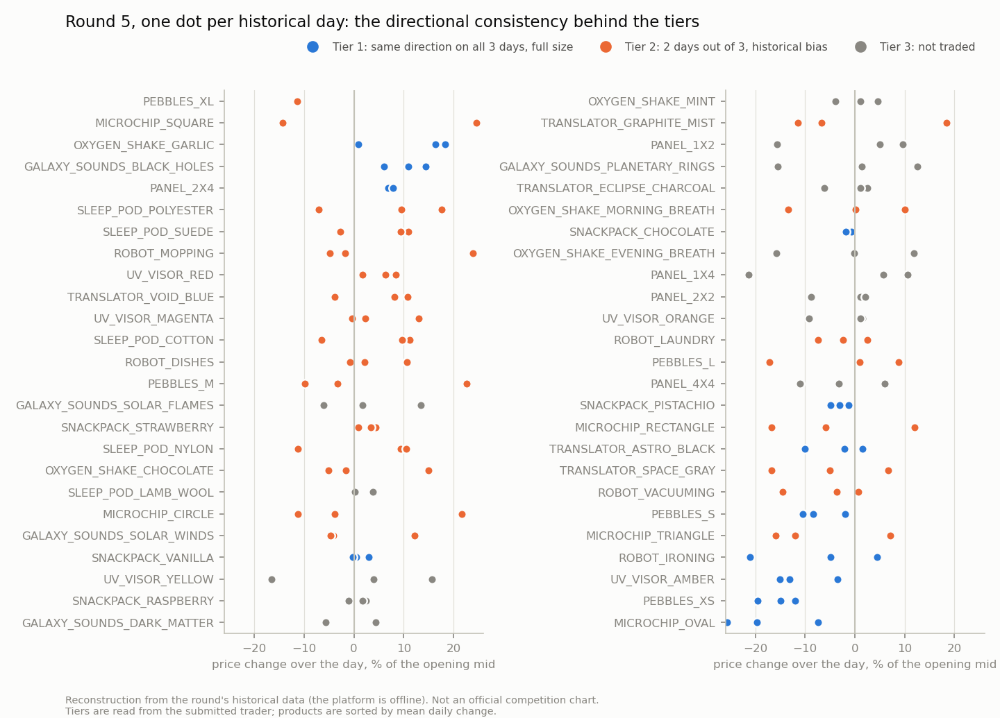
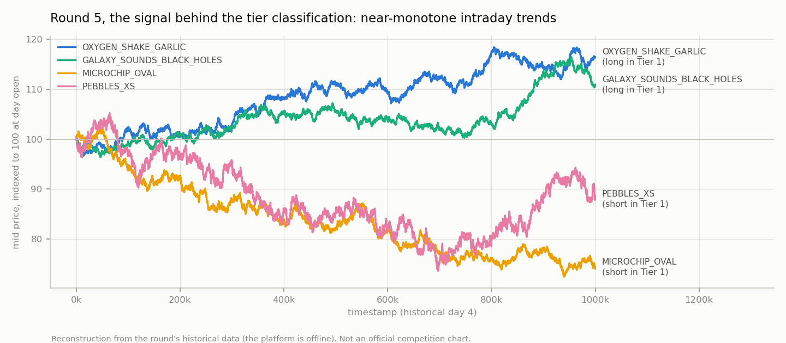

# Round 5: The Final Stretch

**Final leaderboard: #845 worldwide, #39 in France · Final-phase total about 245,000 XIRECs**

## The round

Everything changed for the last round: 50 new products across 10 categories (5 per category), position limit 10 on each, and the products from earlier rounds no longer tradable. The manual challenge was a news-driven portfolio on the Ignith market, covered in [MANUAL.md](MANUAL.md).

## Strategy ([trader.py](trader.py), the submitted version)

### Classification by directional consistency

With 3 days of history (days 2 to 4) and 50 products, I ran a linear regression per product per day: slope, R², and whether the direction held across the 3 days. The finding that shaped the round: most products showed strong, near-monotone intraday linear trends. That calls for a directional strategy, not market making.

Products were bucketed into three tiers:

- **Tier 1** (12 products, same direction 3 days out of 3): hardcoded direction, full ±10 position taken immediately. Longs include `OXYGEN_SHAKE_GARLIC` and `GALAXY_SOUNDS_BLACK_HOLES`; shorts include `MICROCHIP_OVAL`, `PEBBLES_XS`, `UV_VISOR_AMBER`.
- **Tier 2** (24 products, 2 days out of 3): historical directional bias, also at ±10.
- **Tier 3** (14 products, noise or negligible slope): no trading. 11 are skipped explicitly in the code and 3 more fall through the code's unknown-symbol guard, which skips by design.

*Reconstruction from the round's historical data ([script](../analysis/figures/generate_figures.py)). Tier 1 is visible as the rows whose three dots sit on the same side of zero.*

Execution crosses the spread: take the available liquidity in the trend direction, then rest the remainder at the touch.

*Reconstruction from the round's historical data; not an official competition chart.*

### What was tested and rejected

- **EMA-based direction detection for Tier 2** (double EMA, alpha 0.10 / 0.01): +413K versus +621K in backtest for the simple hardcoded historical bias, take-only fills (`--match-trades none`). The sophisticated intraday signal lost to the dumb prior, so the prior shipped.
- **v2, Tier 2 at half size (±5)**: see the live test below.
- A v3 with delayed entry was discussed but not built.

### The v1 versus v2 live test

Both variants ran as live platform tests before the final submission. v1 (Tier 2 at full size) scored **+24,130**; v2 (half size) scored **+14,459**; their drawdowns were nearly identical (-15K and -17K). Halving Tier 2 gave up about 10K of upside while reducing essentially no risk, so v1 was submitted. See [ADR 006](../docs/decisions/006-variance-reduction-must-earn-its-cost.md).

To be explicit about what these numbers are: **they are pre-submission live tests, not official round results.** The final round simulation ran on a different day.

The live tests also exposed the largest backtest-to-live gap of my competition, roughly 10x (about 207K per day projected against 24K realized in test): a regime change in the round data, part of Tier 2 running against its historical bias, and realized slopes smaller than historical ones.

## Result

The platform closed before I saved the round 5 result page, so the official split between the algorithmic and manual challenges is lost. What stands:

- **Final leaderboard: #845 worldwide, #39 in France.**
- **Final-phase total: about 245,000 XIRECs** (I remember the figure to the nearest thousand, not the last three digits).
- By subtraction from the 125,797 recorded after round 4, round 5 brought in roughly 120,000 combined, my best round of the final phase, and the rank moved from 1,445 to 845: about 600 places gained on the last round.
